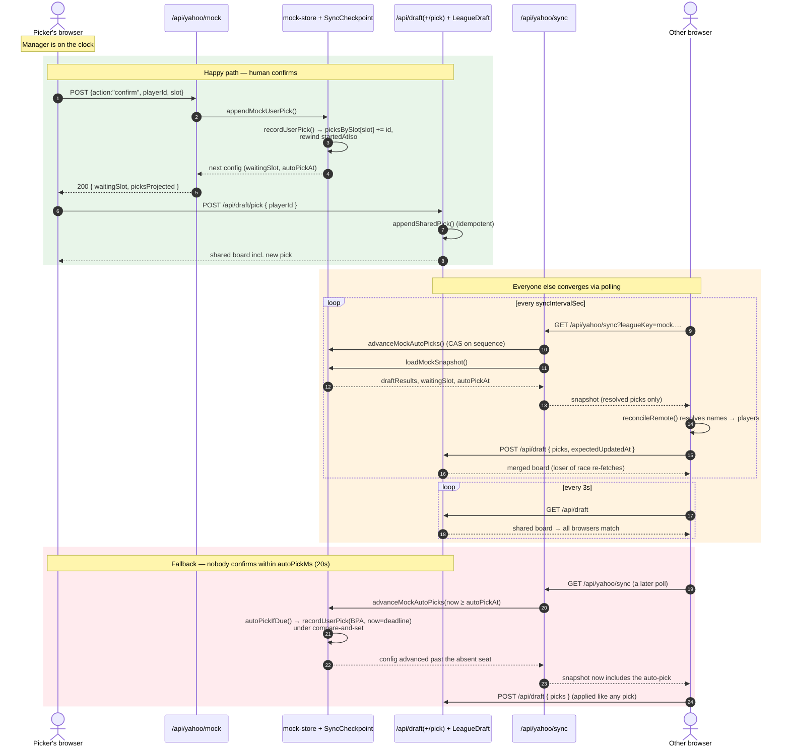

# Architecture (technical)

Engineering companion to `HOW-IT-WORKS.md`. This describes how the app is built,
how requests flow, and where each responsibility lives.

## Stack

| Concern | Choice |
|---|---|
| Framework | Next.js 15 (App Router) + React 19, TypeScript |
| Styling | Tailwind v4 (PostCSS) + hand-written `globals.css` |
| Data source (rankings) | Boris Chen weekly tiers (0.5 PPR default; PPR + standard available) |
| Data source (league) | Yahoo Fantasy API v2 (read-only, XML) |
| ORM / DB | Prisma 6 → Postgres (Neon in prod) |
| XML / CSV parsing | `fast-xml-parser`, `papaparse` |
| Tests | Vitest (unit), Playwright (e2e) |
| Hosting | Vercel; DB on Neon |

Runtime note: every route that touches Prisma, Node crypto, or `fetch` with
streaming sets `export const runtime = "nodejs"` (not edge).

## Directory map

```
src/
  app/                 # App Router: pages + route handlers
    api/               # server endpoints (see "HTTP surface")
    login/             # Yahoo + Sleeper connect
    page.tsx           # landing page (dojo.football)
    app/page.tsx       # signed-in board host -> <DraftAssistant/>
    demo/page.tsx      # anonymous lobby; ?room=<id> -> DraftAssistant demo
    demo/lobby.tsx     # list/join rooms, custom room form, invite-link step
    weekly/page.tsx    # in-season host -> <WeeklyHq/>
    media/             # streams the login GIF + MP3
  adapters/            # I/O at the edges (impure)
    chen/              # CSV parse + DB-cached fetch of Boris Chen
    yahoo/             # OAuth, API client, XML parsers, mock engine
  domain/              # pure logic, no I/O (snake math, recs, lineup, identity)
  persistence/         # Prisma client + shared-draft repository
  auth/                # session tokens, board access, demo session, current user
  config/              # scoring defaults / weights
  fixtures/            # synthetic players used before real data loads
  middleware.ts        # two-stage auth gate for every request
prisma/                # schema + SQL migrations
tests/                 # unit + e2e
```

The hard rule: **`domain/` is pure and framework-independent** — it imports
nothing from `app/`, `adapters/`, or Prisma, so it's trivially unit-testable.
`adapters/` and `persistence/` own all I/O. `app/` wires them together.

## Authentication

There is **no house password** and **no approval step** — both were removed when the
app became public (Draft Dojo). `middleware.ts` no longer gates access; most
draft/demo/rankings routes are public at the edge and enforce authorization **inside
the route** via `requireBoardAccess` (`auth/board-access.ts`).

Identity is still a `SESSION_COOKIE_NAME` HMAC-signed token (`auth/session.ts`)
carrying `{ userId, status, role, exp }`, set on Yahoo or Sleeper connect. New users
are created `active` immediately; there is no `pending`/`/pending` flow (that route now
redirects to `/app`).

Three entry points:

- **`/demo`** — anonymous. A `dojo_demo` cookie (`auth/demo-session.ts`) carries
  `{ roomId, slot, role }`; no `User` row. The lobby lists public rooms or creates
  a custom scoring/team-count/round-count setup. `/demo?room=<id>` is its stable
  invite URL; recipients begin as spectators and claim an open seat.
- **Sleeper** — `POST /api/sleeper/connect` looks up the username, upserts a `User`
  with `yahooGuid = sleeper:{userId}` and dummy tokens, and attaches the draft.
- **Yahoo** — OAuth below.

### Yahoo OAuth (`adapters/yahoo/oauth.ts`)

- Authorization-code flow, scope `openid profile` (no email). Tokens are encrypted at
  rest with AES-256-GCM using `TOKEN_ENCRYPTION_KEY` and stored per-user on the `User` row.
- Every new Yahoo user is created `active` and lands on their own board
  (`boardId = yahoo:{guid}`); no admin approval. Pre-existing house-league users keep the
  shared `house-2026` board.
- User identity (GUID + display name) is extracted from the `id_token`/userinfo
  with several fallbacks (`yahooGuidFromTokens`).
- `getValidYahooAccessToken` refreshes expiring tokens. A module-level
  **single-flight map** (`inflightRefreshes`) coalesces concurrent refreshes for
  the same user so heavy polling can't trigger a refresh stampede.
- Decrypt failures (e.g. after a key rotation) are swallowed on login so Yahoo
  can just mint fresh tokens.

## Data model (Prisma)

| Model | Purpose |
|---|---|
| `User` | Yahoo- or Sleeper-authenticated member: encrypted tokens, role/status, `boardId`, Sleeper fields (`sleeperUsername`, `sleeperLeagueId`, `sleeperDraftId`), per-user prefs (`draftSlot`, `teamName`, pins, avoids, weights, dark mode), `lastSeenAt` for presence. |
| `LeagueDraft` | A board, keyed by `id`: `house-2026` (house league), `yahoo:{guid}`, `sleeper:{draftId}`, or `demo:{uuid}`. Holds mode, team count, rounds, `picksJson`, `playersJson`, ranking `source`/`importedAt`, `leagueKey`. |
| `DataImport` | Cached Boris Chen imports (payload + `fetchedAt` for staleness). |
| `SyncCheckpoint` | Generic key/value+sequence store; used for mock-draft configs (`mock:<leagueKey>`) and resolved Yahoo draft snapshots. |
| `LeagueConnection` | Per-league sync bookkeeping (last sync time / error). |
| `OAuthCredential`, `DraftSession`, `PlayerMapping` | Legacy/earlier-iteration tables, retained by migrations. |

There are **many** `LeagueDraft` rows — one per board (house league, each Yahoo/Sleeper
user, and each demo room). Persistence takes a `draftId` throughout
(`persistence/league-draft.ts`); a user is routed to their board by `User.boardId`.
Per-user differences (slot, pins, avoids, weights) live on `User` and are projected
onto the resolved board at read time.

## HTTP surface (`app/api`)

| Endpoint | Method | Role |
|---|---|---|
| `/api/auth/logout` `/dev-login` | — | sign out + E2E login |
| `/api/yahoo/auth` `/callback` `/status` `/leagues` | — | OAuth start/return, connection status, league list |
| `/api/sleeper/connect` | POST | username lookup, then attach a Sleeper draft to a board |
| `/api/demo` `/api/demo/join` | GET/POST | open/resume a specific demo room; claim a chosen seat |
| `/api/demo/create` | POST | create a public room with scoring, teams, rounds, and creator slot |
| `/api/demo/rooms` | GET | list active rooms with completion status, settings, activity, and exact open seats |
| `/api/draft` | GET/PUT | read board for `?draftId` (+ my prefs); reset/replace players/set league/apply picks |
| `/api/draft/pick` | POST | append pick / undo / advance one / simulate to my turn |
| `/api/me` | GET/PUT | current user's prefs |
| `/api/admin/users` | GET/PATCH | admin: list + assign slot/rename (no approvals) |
| `/api/chen` | GET | fetch (or read cached) Boris Chen import (`?scoring=half-ppr\|ppr\|standard`) |
| `/api/yahoo/mock` | POST/GET/DELETE | start/confirm, inspect, stop a mock |
| `/api/yahoo/sync` | GET | unified draft snapshot (mock or real Yahoo) |
| `/api/weekly` | GET | in-season roster + optimal lineup + waivers + activity |

`/api/draft` GET is the client's 3-second heartbeat and also opportunistically
calls `ensureFreshBoardPlayers()` (throttled) — see "Rankings pipeline".

## Domain logic (`src/domain`, pure)

- **`snake.ts`** — snake-draft math: `selectionForOverall`, next-turn helpers.
- **`draft.ts`** — draft state transitions: `makeManualPick`, `undoLastPick`,
  `opponentPick`, `simulateToUserTurn`, `availablePlayers`.
- **`recommendation.ts`** — factor-based scorer. Each candidate accrues weighted,
  explainable signals: `chenRank`, `chenTier`, `tierCliff`, `positionalScarcity`,
  `positionalNeed`, `flexValue`, `rosterBalance`, `turnUrgency`, `adpValue`,
  `byeConcentration`, `teamConcentration`, `earlySpecialist`, `backupPenalty`.
  Weights come from the user; `excludePlayerIds` drops avoided players.
- **`lineup.ts`** — weekly start/sit optimizer: fills dedicated then flex slots by
  value, emits concrete swap suggestions and injury/bye alerts.
- **`identity.ts`** — name normalization + alias resolution so Yahoo player keys
  and Chen names reconcile; surfaces ambiguous matches instead of guessing.
- **`roster.ts` / `sync.ts` / `types.ts`** — roster-slot assignment, snapshot
  reconciliation helpers, shared types.

## Rankings pipeline (Boris Chen)

1. `adapters/chen/server-cache.ts`
   - `fetchChenImport(scoring)` pulls the matching CSV (0.5 PPR by default),
     parses via `boris-chen.ts`, and writes a `DataImport` row keyed by format
     (`boris-chen-half-ppr` / `boris-chen-ppr` / `boris-chen-standard`).
   - `getFreshChenImport(maxAgeMs = 6h, scoring)` serves the cached row if
     fresh, else fetches live, else falls back to the stale cache.
2. `persistence/league-draft.ts`
   - On board creation, seeds `playersJson` from `getFreshChenImport()` (live if
     the cache is empty), else synthetic `MOCK_PLAYERS`.
   - `ensureFreshBoardPlayers()` (called from `/api/draft` GET, throttled to once
     / 10 min per instance) refreshes the board's players **only while
     `picks.length === 0`**, so rankings never shift mid-draft. Admins can force a
     refresh via `/api/chen?scoring=` or the Best available scoring toggle.
     Switching formats remaps `chenRank` / `chenTier` / ADP on existing players
     and does not clear picks.
3. **Player metadata backfill** — Chen's tier CSV has no team, bye, headshot, or
   ownership columns, so `adapters/yahoo/player-meta.ts` pulls the top ~300 players
   from Yahoo (team + full team name + `bye_weeks` + `image_url` + `percent_owned` +
   injury status + `player_key`), cached in `DataImport` for 12h and keyed by
   normalized name + position. `ensureBoardByes()` (`/api/draft` GET, throttled
   30 min/instance) merges that onto any board player still missing a bye or photo,
   which also powers the click-to-open player detail card in the UI. Best-effort: it
   no-ops when Yahoo isn't connected, so fields simply stay blank until it is. Team
   defenses aren't matched (Chen nickname vs Yahoo city name), so DEF metadata may
   remain blank.

## Draft synchronization

Both mock and live drafts flow through one client loop and one snapshot endpoint.

- **Client** (`components/draft-assistant.tsx`) polls `/api/yahoo/sync` on an
  interval and `reconcileRemote()` applies any new picks onto the shared board via
  `/api/draft` (`action: "picks"`) using optimistic concurrency
  (`expectedUpdatedAt`); the loser of a race re-fetches. Every client also polls
  `/api/draft` every 3s so all browsers converge on the same board.
- **`/api/yahoo/sync`** returns a uniform snapshot:
  - Real league → `fetchRealSnapshot()` calls the Yahoo API, then resolves player
    keys → names via `getPlayersByKeys` (cached per process).
  - Mock → `loadMockSnapshot()` from the mock engine.

### Mock engine (`adapters/yahoo/mock-runner.ts`) — multi-seat

Pure, deterministic BPA simulator with soft per-position caps.

- Config carries `humanSlots: number[]` and `picksBySlot: Record<slot, id[]>`
  (a legacy `userSlot`/`userPicks` shape is auto-normalized).
- `projectedDraftOrder()` walks overall picks; robots fill non-human slots by
  best-available, and the projector **stops at any human slot** with no confirmed
  pick yet.
- `elapsedPickCount()` converts wall-clock → picks due; `waitingSlot()` returns the
  human slot currently on the clock (projector stopped **and** the clock reached it).
- `recordUserPick(config, playerId, now, expectedSlot?)` appends to whichever seat
  is on the clock (validating `expectedSlot` to block out-of-turn confirms) and
  rewinds `startedAtIso` so the next robot pick is exactly one interval out.
- **Auto-draft** (`autoPickMs`, default 20s for multi-human mocks): `autoPickDeadline()`
  is the epoch ms a pending human seat lapses; `autoPickIfDue()` picks best-available
  for that seat and re-uses `recordUserPick` with `now = deadline` so following robots
  resume from the deadline, not from wall-clock (no burst of skipped picks).

`mock-store.ts` persists configs in `SyncCheckpoint`; the store/route validate and
expose `waitingSlot` + `autoPickAt` to the client. `advanceMockAutoPicks()` applies
any overdue auto-picks under a compare-and-set on the checkpoint `sequence`, so
concurrent pollers (multiple browsers/instances) can't double-record. It runs at the
start of the sync + mock GET paths, so auto-picks flow to the shared board through the
normal reconcile path (`appendSharedPick` is idempotent to absorb confirm races).
Net effect: a practice mock pauses at **every** real manager's seat, so all managers
rehearse simultaneously, each on their own screen, while robots fill unclaimed seats —
and an absent manager is auto-drafted after 20s so the room never stalls.

### Request flow: a mock pick (confirm → store → sync → board)

Two stores cooperate: the **mock config** (`SyncCheckpoint`, source of truth for
draft order) and the **shared board** (`LeagueDraft`, what every browser renders).
The picker's own browser writes both; every other browser catches up by polling.



Key invariants the diagram encodes:

- The mock snapshot only ever publishes **resolved** picks and omits the seat on
  the clock, so `reconcileRemote` can apply everything it receives, in order.
- Auto-picks and human confirms both land in `picksBySlot`, so they replay
  identically on every client — the board never diverges on who drafted whom.
- `appendSharedPick` is idempotent and `/api/draft` writes are guarded by
  `expectedUpdatedAt`, so the picker's own write and a peer's synced write can
  race safely (one wins, the other is a no-op or re-fetch).

## Weekly HQ

`/api/weekly` fans out Yahoo calls (teams, league meta, roster, standings,
scoreboard, transactions, free agents) in parallel, enriches with Chen data
(auto-refreshed if stale), runs `optimizeLineup`, and returns lineup + alerts +
waiver targets + activity. All Yahoo access is **read-only**, so every suggestion
is advisory — the user makes actual moves in Yahoo. XML parsing lives in
`adapters/yahoo/parsers.ts` (pure, unit-tested).

## Client state model

`DraftAssistant` holds transient UI state and mirrors the shared board:
- `stateRef` / `membersRef` give effect callbacks (poll loops) access to the
  latest state without re-subscribing.
- `applyPayload()` maps the `/api/draft` response into local state and projects
  the user's own slot/prefs.
- Presence: `presenceLabel()` turns `lastSeenAt` into online/last-seen chips;
  `touchLastSeen()` (server, throttled 30s) records activity on each board read.
- Admin-only affordances (start draft launcher, member management, sync/rankings
  controls) are gated on `me.role === "admin"`, with a "view as member" preview.

## Testing

- **Unit (Vitest)** — the pure domain plus adapters: snake math, recommendations,
  lineup, identity, Chen CSV parsing, Yahoo XML parsers, OAuth URL/GUID, session
  tokens, and the multi-seat mock engine.
- **E2E (Playwright)** — `tests/e2e/simulation.spec.cjs` drives the two-stage login
  and a simulated draft.

## Environment variables

| Var | Purpose |
|---|---|
| `DATABASE_URL` / `DATABASE_URL_UNPOOLED` | Postgres (pooled + direct for migrations) |
| `APP_ACCESS_PASSWORD` | house-password gate |
| `TOKEN_ENCRYPTION_KEY` | AES-256-GCM key for Yahoo tokens at rest |
| `YAHOO_CLIENT_ID` / `YAHOO_CLIENT_SECRET` / `YAHOO_REDIRECT_URI` | OAuth app |
| `CHEN_HALF_PPR_CSV_URL` / `CHEN_PPR_CSV_URL` / `CHEN_STANDARD_CSV_URL` | override Boris Chen CSV sources |
| `E2E_LOGIN_SECRET` | bypass token for Playwright login |

Rotating `TOKEN_ENCRYPTION_KEY` invalidates stored tokens; users simply re-auth
(login tolerates the decrypt failure and stores fresh tokens).
